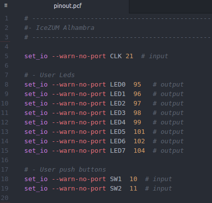

# PCF language support in Atom

[](https://travis-ci.org/Jesus89/atom-language-pcf)
[](https://david-dm.org/Jesus89/atom-language-pcf)

Adds syntax highlighting to **Physical Constraints File (PCF)** in Atom.



## Install

Install the package `language-pcf` in Atom (Preferences->Packages) or Atom's package manager from a shell:

```bash
$ apm install language-pcf
```

## Author

* [Jesús Arroyo Torrens](https://github.com/Jesus89)

## License

Licensed under [MIT](http://opensource.org/licenses/MIT).
